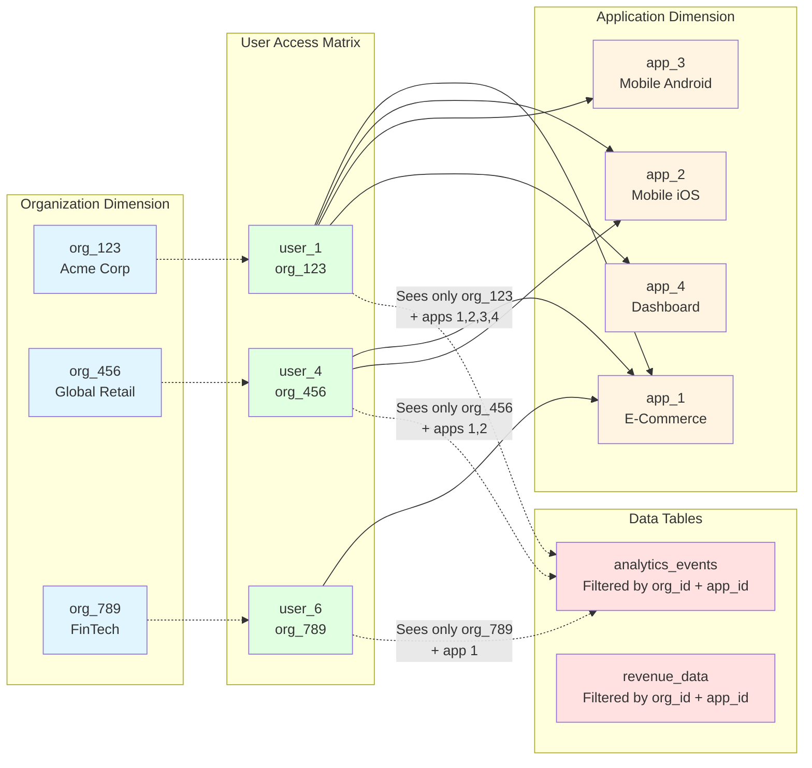
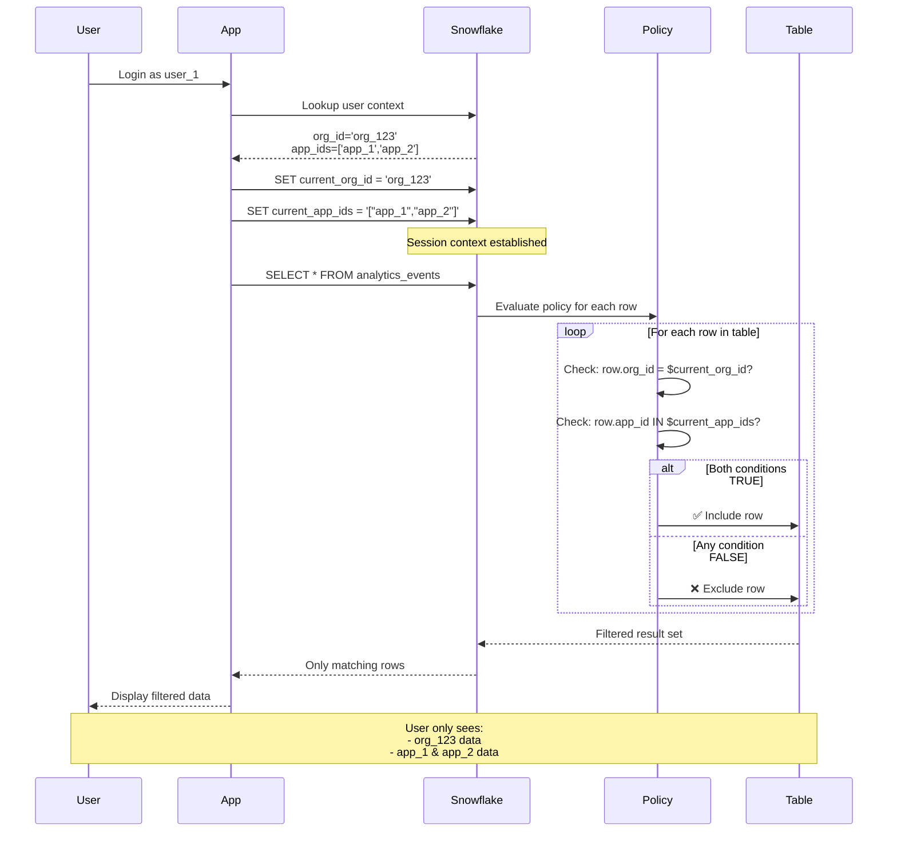

# Snowflake Multi-Tenant Analytics with Row Access Policies

A minimal, production-ready implementation of multi-tenant data isolation in Snowflake using row access policies for automatic data filtering.

[](https://www.snowflake.com/)
[](https://www.snowflake.com/)

---

## 📋 Table of Contents

- [Overview](#-overview)
- [Quick Start](#-quick-start)
- [Architecture](#-architecture)
- [How It Works](#-how-it-works)
- [Deployment](#-deployment)
- [Testing](#-testing)
- [Sample Data](#-sample-data)
- [Security](#-security)
- [Production Considerations](#-production-considerations)
- [Troubleshooting](#-troubleshooting)

---

## 🎯 Overview

This project implements **secure multi-tenant data isolation** in Snowflake where:

- **Each organization only sees their own data** (org_id filtering)
- **Users only see data for authorized applications** (app_ids filtering)
- **Filtering is automatic** and enforced at the database level
- **No application-level WHERE clauses** needed
- **Zero-trust security** - no context = no data

### Use Cases

- **SaaS Applications** - Multi-tenant data isolation
- **Analytics Platforms** - Per-customer data segregation
- **Data Warehouses** - Organization-level access control
- **B2B Platforms** - Customer data separation

### Key Benefits

✅ **Secure** - Database-level enforcement  
✅ **Simple** - No complex application logic  
✅ **Automatic** - No WHERE clauses needed  
✅ **Performant** - Policies are compiled, not evaluated per row  
✅ **Auditable** - Snowflake logs all access  
✅ **Scalable** - Works with any data volume  

---

## 🚀 Quick Start

### 1. Deploy

```bash
cd deploy
./deploy.sh
```

This creates:
- 1 Database (ANALYTICS_DB)
- 12 Tables with sample data
- 12 Row Access Policies
- Comprehensive test suite

### 2. Test

```bash
snow sql -q "
  USE DATABASE ANALYTICS_DB;
  SET current_org_id = 'org_123';
  SET current_app_ids = '[\"app_1\", \"app_2\"]';
  SELECT * FROM analytics_events;
"
```

### 3. Verify

```sql
-- Test org_123 with apps 1 and 2
SET current_org_id = 'org_123';
SET current_app_ids = '["app_1", "app_2"]';

SELECT COUNT(*) FROM organizations;      -- Returns: 1
SELECT COUNT(*) FROM applications;       -- Returns: 2
SELECT COUNT(*) FROM analytics_events;   -- Returns: 4

-- Test isolation: org_123 can't see org_456 data
SELECT * FROM organizations WHERE org_id = 'org_456';  -- Returns: 0 rows
```

---

## 🏗️ Architecture

### File Structure (4 SQL files - 38 KB)

```
deploy/
├── 01_setup_and_data.sql      20 KB  - Database + Tables + Data
├── 02_create_policies.sql     5.7 KB - Row Access Policies
├── 03_apply_policies.sql      3.9 KB - Apply Policies
├── 04_test_policies.sql       6.4 KB - Tests (optional)
├── README.md                  (this file)
├── deploy.sh                  - Deployment script
├── rollback.sql               - Cleanup script
├── default.conf               - Configuration
└── config.conf.example        - Config template
```

### Data Model



**Organization Tables:**
- `organizations` - Organization master data
- `organization_settings` - Org-specific settings
- `organization_billing` - Billing records
- `organization_users` - Users per organization

**Application Tables:**
- `applications` - Application catalog
- `app_configuration` - App configurations
- `app_performance_metrics` - Performance data

**Cross-Dimensional Tables:**
- `user_app_access` - User access to apps
- `analytics_events` - Event tracking (org_id + app_id)
- `revenue_data` - Transaction data (org_id + app_id)
- `session_data` - User sessions (org_id + app_id)
- `daily_aggregates` - Daily metrics (org_id + app_id)

---

## 🔧 How It Works

### Security Context Flow

The security model uses **two-dimensional filtering** with org_id and app_ids:

```mermaid
graph TB
    subgraph "1. User Authentication"
        A[User Login] --> B[Lookup User Context]
        B --> C[Get org_id]
        B --> D[Get app_ids Array]
    end
    
    subgraph "2. Set Session Context"
        C --> E[SET current_org_id = 'org_123']
        D --> F["SET current_app_ids = '[\"app_1\", \"app_2\"]'"]
    end
    
    subgraph "3. Row Access Policy Evaluation"
        E --> G{Policy Check}
        F --> G
        G -->|org_id Match?| H{app_id Match?}
        H -->|Both Match| I[✅ Return Row]
        H -->|No Match| J[❌ Filter Out]
        G -->|No Match| J
    end
    
    subgraph "4. Query Results"
        I --> K[Filtered Data]
        J --> L[Row Excluded]
        K --> M[User Sees Only:<br/>- Their org data<br/>- Their allowed apps]
    end
    
    style A fill:#e1f5ff
    style E fill:#fff4e1
    style F fill:#fff4e1
    style G fill:#ffe1e1
    style H fill:#ffe1e1
    style I fill:#e1ffe1
    style J fill:#ffe1e1
    style M fill:#e1ffe1
```

### Row Access Policies

Policies use **direct session variable references** for filtering:

```sql
-- Organization filtering
CREATE ROW ACCESS POLICY policy_organizations
AS (org_id VARCHAR) RETURNS BOOLEAN ->
    org_id = $current_org_id;

-- Application filtering
CREATE ROW ACCESS POLICY policy_applications
AS (app_id VARCHAR) RETURNS BOOLEAN ->
    ARRAY_CONTAINS(app_id::VARIANT, PARSE_JSON($current_app_ids));

-- Combined filtering (org + apps)
CREATE ROW ACCESS POLICY policy_analytics_events
AS (org_id VARCHAR, app_id VARCHAR) RETURNS BOOLEAN ->
    org_id = $current_org_id
    AND ARRAY_CONTAINS(app_id::VARIANT, PARSE_JSON($current_app_ids));
```

### Session Context

Before querying, set session variables:

```sql
SET current_org_id = 'org_123';
SET current_app_ids = '["app_1", "app_2", "app_3"]';
```

All subsequent queries are **automatically filtered**:

```sql
-- Only returns org_123
SELECT * FROM organizations;

-- Only returns app_1, app_2, app_3
SELECT * FROM applications;

-- Only returns events for org_123 AND allowed apps
SELECT * FROM analytics_events;
```

### Policy Application

Each table has a policy attached:

```sql
-- Apply policy to table
ALTER TABLE analytics_events 
    ADD ROW ACCESS POLICY policy_analytics_events 
    ON (org_id, app_id);
```

Once applied, **all queries** are automatically filtered by the policy.

### Policy Enforcement Mechanism



---

## 📦 Deployment

### Configuration

Edit `deploy/default.conf`:

```bash
# Database settings
DATABASE_NAME=ANALYTICS_DB
SCHEMA_NAME=PUBLIC
WAREHOUSE_NAME=COMPUTE_WH
WAREHOUSE_SIZE=XSMALL
WAREHOUSE_AUTO_SUSPEND=60
WAREHOUSE_AUTO_RESUME=TRUE

# Testing
RUN_TESTS=TRUE  # Set to FALSE to skip tests
```

### Deploy

```bash
cd deploy
./deploy.sh
```

The script will:
1. Create database, schema, and warehouse
2. Create 12 tables with sample data
3. Create 12 row access policies
4. Apply policies to all tables
5. Run comprehensive tests (optional)

**Deployment time:** ~60 seconds

### Rollback

To remove everything:

```bash
cd deploy
snow sql -f rollback.sql \
  -D database_name="ANALYTICS_DB" \
  -D warehouse_name="COMPUTE_WH"
```

---

## 🧪 Testing

### Automated Tests

The deployment includes comprehensive tests in `04_test_policies.sql`:

```bash
# Run with tests (default)
./deploy.sh

# Skip tests
# Edit default.conf: RUN_TESTS=FALSE
./deploy.sh
```

### Manual Testing

```sql
-- Test Case 1: user_1 (org_123, apps 1,2,3,4)
SET current_org_id = 'org_123';
SET current_app_ids = '["app_1", "app_2", "app_3", "app_4"]';

SELECT COUNT(*) FROM organizations;      -- Returns: 1
SELECT COUNT(*) FROM applications;       -- Returns: 4
SELECT COUNT(*) FROM analytics_events;   -- Returns: 5

-- Test Case 2: user_4 (org_456, apps 1,2,6)
SET current_org_id = 'org_456';
SET current_app_ids = '["app_1", "app_2", "app_6"]';

SELECT COUNT(*) FROM organizations;      -- Returns: 1
SELECT COUNT(*) FROM applications;       -- Returns: 3
SELECT COUNT(*) FROM analytics_events;   -- Returns: 3

-- Test Case 3: Cross-org isolation
SET current_org_id = 'org_123';
SET current_app_ids = '["app_1"]';

-- Attempt to query org_456 data (should return 0)
SELECT * FROM organizations WHERE org_id = 'org_456';  -- Returns: 0 rows
SELECT * FROM analytics_events WHERE org_id = 'org_456';  -- Returns: 0 rows
```

---

## 📊 Sample Data

### Organizations (5 total)

| org_id   | org_name             | tier       | country   |
|----------|----------------------|------------|-----------|
| org_123  | Acme Corporation     | enterprise | USA       |
| org_456  | Global Retail Inc    | pro        | UK        |
| org_789  | FinTech Solutions    | enterprise | USA       |
| org_101  | HealthCare Plus      | pro        | Canada    |
| org_202  | EduTech Systems      | free       | Australia |

### Applications (7 total)

| app_id | app_name                | type         | platform |
|--------|-------------------------|--------------|----------|
| app_1  | E-Commerce Web          | web          | web      |
| app_2  | Mobile Shopping iOS     | mobile_ios   | ios      |
| app_3  | Mobile Shopping Android | mobile_android| android  |
| app_4  | Admin Dashboard         | web          | web      |
| app_5  | Analytics API           | api          | api      |
| app_6  | Customer Portal         | web          | web      |
| app_7  | Internal Tools          | web          | web      |

### User Access Examples

| user_id | org_id  | accessible_apps     |
|---------|---------|---------------------|
| user_1  | org_123 | app_1, app_2, app_3, app_4 |
| user_4  | org_456 | app_1, app_2, app_6 |
| user_6  | org_789 | app_1, app_5, app_6 |

---

## 🔐 Security

### Critical Requirements

⚠️ **Session context MUST be set before querying data**

If context is not set → **ZERO rows returned** (by design to prevent data leakage)

### Security Model

```sql
-- ❌ WRONG - No Context
SELECT * FROM analytics_events;
-- Returns: 0 rows (policy blocks all data)

-- ✅ CORRECT - Set Context First
SET current_org_id = 'org_123';
SET current_app_ids = '["app_1", "app_2"]';
SELECT * FROM analytics_events;
-- Returns: Filtered rows for org_123 + allowed apps
```

### Policy Behavior

| org_id      | app_ids         | Result | Rows Returned |
|-------------|-----------------|--------|---------------|
| NULL        | NULL            | ❌ FALSE | 0           |
| NULL        | `["app_1"]`     | ❌ FALSE | 0           |
| `"org_123"` | NULL            | ❌ FALSE | 0           |
| `"org_123"` | `[]`            | ❌ FALSE | 0           |
| `"org_123"` | `["app_1"]`     | ✅ TRUE  | Filtered    |

**Key:** Both org_id AND app_ids must be properly set, or NO data is returned.

### Security Benefits

✅ **Fail-Safe Design** - No context = No data  
✅ **Database-Level Enforcement** - Impossible to bypass  
✅ **Multi-Tenant Isolation** - Complete data separation  
✅ **Zero-Trust Architecture** - Explicit authentication required  
✅ **Automatic Filtering** - No manual WHERE clauses  
✅ **Audit Trail** - Snowflake logs all access  

### Security Checklist

Before deploying to production:

- [ ] All tables have row access policies applied
- [ ] Application always sets context before queries
- [ ] Context validation implemented
- [ ] Error handling for missing context
- [ ] Test cases verify 0 rows returned when context missing
- [ ] Audit logging enabled
- [ ] SSL/TLS enabled for Snowflake connections
- [ ] Credentials rotated regularly

---

## 🚀 Production Considerations

### Session Management

In production, integrate session context with your authentication:

```python
# Python example
def set_snowflake_context(conn, user):
    org_id = user.organization_id
    app_ids = json.dumps([app.id for app in user.accessible_apps])
    
    conn.cursor().execute(f"SET current_org_id = '{org_id}'")
    conn.cursor().execute(f"SET current_app_ids = '{app_ids}'")
```

```javascript
// Node.js example
async function setSnowflakeContext(connection, user) {
  const orgId = user.organizationId;
  const appIds = JSON.stringify(user.accessibleApps.map(app => app.id));
  
  await connection.execute(`SET current_org_id = '${orgId}'`);
  await connection.execute(`SET current_app_ids = '${appIds}'`);
}
```

### Alternative Approaches

If session variables don't fit your use case:

#### Option 1: CURRENT_USER() with Mapping Table

```sql
CREATE TABLE user_context_mapping (
    snowflake_user VARCHAR PRIMARY KEY,
    org_id VARCHAR NOT NULL,
    app_ids ARRAY NOT NULL
);

CREATE ROW ACCESS POLICY policy_organizations
AS (org_id VARCHAR) RETURNS BOOLEAN ->
    org_id IN (
        SELECT org_id FROM user_context_mapping 
        WHERE snowflake_user = CURRENT_USER()
    );
```

**Pros:** No session variables needed  
**Cons:** Requires user mapping table maintenance

#### Option 2: Secure Views

```sql
CREATE SECURE VIEW organizations_filtered AS
SELECT * FROM organizations
WHERE org_id = $current_org_id;
```

**Pros:** Simpler than policies  
**Cons:** Still requires session variables, less secure

#### Option 3: Application-Level Filtering

```sql
-- Add WHERE clauses in application code
SELECT * FROM analytics_events 
WHERE org_id = ? AND app_id IN (?, ?, ?);
```

**Pros:** No Snowflake-specific features needed  
**Cons:** Less secure, error-prone, requires manual filtering

### Performance

- **Small datasets (<1M rows)**: No optimization needed
- **Large datasets (>1M rows)**: Consider adding clustering keys
- **Very large datasets (>100M rows)**: Use materialized views for aggregations

To enable clustering (optional):

```sql
-- Add clustering keys to large tables
ALTER TABLE analytics_events CLUSTER BY (org_id, event_timestamp);
ALTER TABLE revenue_data CLUSTER BY (org_id, transaction_date);
```

### Monitoring

```sql
-- Check policy application
SELECT * FROM information_schema.policy_references
WHERE policy_name LIKE 'POLICY_%';

-- Monitor query performance
SELECT * FROM snowflake.account_usage.query_history
WHERE query_text LIKE '%analytics_events%'
ORDER BY start_time DESC
LIMIT 10;

-- Check row access policy usage
SELECT * FROM snowflake.account_usage.access_history
WHERE object_name = 'ANALYTICS_EVENTS'
ORDER BY query_start_time DESC;
```

---

## 🔍 Troubleshooting

### Problem: Query Returns 0 Rows

**Cause:** Session context not set

**Solution:** Set context before querying

```sql
-- Check current context
SELECT 
    $current_org_id as org_id,
    $current_app_ids as app_ids;

-- If NULL, set context
SET current_org_id = 'org_123';
SET current_app_ids = '["app_1", "app_2"]';

-- Try query again
SELECT COUNT(*) FROM analytics_events;
```

### Problem: Session Variables Not Persisting

**Cause:** Each `snow sql -f` execution is a separate session

**Solution:** Set variables and query in the same script or session

```sql
-- In a single .sql file or interactive session
SET current_org_id = 'org_123';
SET current_app_ids = '["app_1"]';
SELECT * FROM organizations;
```

### Problem: Policy Compilation Errors

**Error:** `Session variable '$CURRENT_ORG_ID' does not exist`

**Cause:** Variables don't exist during policy creation

**Solution:** Initialize variables before creating/applying policies

```sql
-- Add to policy creation scripts
SET current_org_id = NULL;
SET current_app_ids = '[]';

-- Then create policies
CREATE ROW ACCESS POLICY ...
```

### Problem: Policy Not Filtering

**Check if policy is applied:**

```sql
SHOW ROW ACCESS POLICIES;

SELECT * FROM information_schema.policy_references
WHERE table_name = 'ANALYTICS_EVENTS';
```

**Verify policy definition:**

```sql
SHOW ROW ACCESS POLICIES LIKE 'policy_analytics_events';
```

### Problem: Performance Issues

**Check query execution:**

```sql
-- View query profile
SELECT * FROM table(information_schema.query_history())
WHERE query_text LIKE '%analytics_events%'
ORDER BY start_time DESC
LIMIT 1;
```

**Consider clustering for large tables:**

```sql
ALTER TABLE analytics_events CLUSTER BY (org_id, event_timestamp);
```

---

## 📚 Additional Resources

### Snowflake Documentation

- [Row Access Policies](https://docs.snowflake.com/en/user-guide/security-row-intro)
- [Session Variables](https://docs.snowflake.com/en/sql-reference/session-variables)
- [Multi-Tenant Architecture](https://docs.snowflake.com/en/user-guide/security-access-control-considerations)

### Best Practices

- [Snowflake Security Best Practices](https://docs.snowflake.com/en/user-guide/security-best-practices)
- [Query Performance Optimization](https://docs.snowflake.com/en/user-guide/performance-query)
- [Clustering Keys](https://docs.snowflake.com/en/user-guide/tables-clustering-keys)

---

## 📝 Summary

### What This Project Provides

✅ **Complete multi-tenant isolation** using row access policies  
✅ **Automatic data filtering** at the database level  
✅ **Production-ready deployment** with comprehensive tests  
✅ **Sample data** for 5 organizations and 7 applications  
✅ **Security by default** - no context = no data  
✅ **Simple architecture** - only 4 SQL files  

### Key Takeaways

1. **Set context before queries** - Always set org_id and app_ids
2. **Policies are automatic** - No WHERE clauses needed
3. **Fail-safe by design** - Missing context returns 0 rows
4. **Database-enforced** - Impossible to bypass
5. **Production-ready** - Tested and documented

### Quick Commands

```bash
# Deploy
cd deploy && ./deploy.sh

# Test
snow sql -q "USE DATABASE ANALYTICS_DB; 
  SET current_org_id = 'org_123'; 
  SET current_app_ids = '[\"app_1\"]'; 
  SELECT COUNT(*) FROM analytics_events;"

# Rollback
snow sql -f rollback.sql -D database_name="ANALYTICS_DB"
```

---

## 📄 License

MIT License - See LICENSE file for details

---

## 🎉 Version

**Current Version:** 2.0 (Ultra-Simplified)
- 4 SQL files (down from 10)
- No stored procedures
- No views
- No clustering (optional)
- Direct session variable approach
- Production-ready and tested

---

**Remember: Context first, queries second!** 🔐
