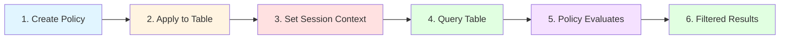

# Snowflake Multi-Tenant Isolation with Row Access Policies

A production-ready implementation of multi-tenant data isolation in Snowflake using **Row Access Policies** for automatic, database-enforced data filtering. This project demonstrates how to implement secure tenant isolation without application-level WHERE clauses.

[](https://www.snowflake.com/)
[](https://www.snowflake.com/)

---

## 📋 Table of Contents

- [Overview](#-overview)
- [Quick Start](#-quick-start)
- [Architecture](#-architecture)
- [How It Works](#-how-it-works)
- [Deployment](#-deployment)
- [Testing](#-testing)
- [Sample Data](#-sample-data)
- [Security](#-security)
- [Production Considerations](#-production-considerations)
- [Troubleshooting](#-troubleshooting)

---

## 🎯 Overview

This project implements **secure multi-tenant data isolation** in Snowflake using **Row Access Policies**:

### What are Row Access Policies?

Row Access Policies are Snowflake's native security feature that automatically filters table rows based on user context. Unlike application-level filtering, policies are:

- **Database-enforced** - Applied before query execution
- **Transparent** - No changes needed to SQL queries
- **Mandatory** - Cannot be bypassed or disabled by users
- **Performant** - Compiled and optimized by Snowflake

### How This Implementation Works

- **Each organization only sees their own data** - Filtered by `org_id` column
- **Users only see data for authorized applications** - Filtered by `app_id` column
- **Filtering is automatic** - Policies enforce rules at the database level
- **No application-level WHERE clauses** needed - Queries are transparently filtered
- **Zero-trust security** - No context = no data (fail-safe default)

### Use Cases

- **SaaS Applications** - Multi-tenant data isolation
- **Analytics Platforms** - Per-customer data segregation
- **Data Warehouses** - Organization-level access control
- **B2B Platforms** - Customer data separation

### Key Benefits

✅ **Secure** - Database-level enforcement  
✅ **Simple** - No complex application logic  
✅ **Automatic** - No WHERE clauses needed  
✅ **Performant** - Policies are compiled, not evaluated per row  
✅ **Auditable** - Snowflake logs all access  
✅ **Scalable** - Works with any data volume  

---

## 🚀 Quick Start

### Prerequisites

- **Snow CLI** installed and configured
  ```bash
  # Install Snow CLI
  pip install snowflake-cli-labs
  
  # Configure connection
  snow connection add
  ```

### 1. Deploy

```bash
cd deploy
./deploy.sh
```

The deployment script will:
- ✓ Check for Snow CLI installation
- ✓ List available Snowflake connections
- ✓ Test connection before deployment
- ✓ Create 1 Database (ANALYTICS_DB)
- ✓ Create 12 Tables with sample data
- ✓ Create 12 Row Access Policies
- ✓ Apply policies to all tables
- ✓ Run comprehensive test suite

### 2. Test

```bash
snow sql -q "
  USE DATABASE ANALYTICS_DB;
  SET current_org_id = 'org_123';
  SET current_app_ids = '[\"app_1\", \"app_2\"]';
  SELECT * FROM analytics_events;
"
```

### 3. Verify

```sql
-- Test org_123 with apps 1 and 2
SET current_org_id = 'org_123';
SET current_app_ids = '["app_1", "app_2"]';

SELECT COUNT(*) FROM organizations;      -- Returns: 1
SELECT COUNT(*) FROM applications;       -- Returns: 2
SELECT COUNT(*) FROM analytics_events;   -- Returns: 4

-- Test isolation: org_123 can't see org_456 data
SELECT * FROM organizations WHERE org_id = 'org_456';  -- Returns: 0 rows
```

---

## 🏗️ Architecture

### File Structure (4 SQL files - 38 KB)

```
deploy/
├── 01_setup_and_data.sql      20 KB  - Database + Tables + Data
├── 02_create_policies.sql     5.7 KB - Row Access Policies
├── 03_apply_policies.sql      3.9 KB - Apply Policies
├── 04_test_policies.sql       6.4 KB - Tests (optional)
├── README.md                  (this file)
├── deploy.sh                  - Deployment script
├── rollback.sql               - Cleanup script
├── default.conf               - Configuration
└── config.conf.example        - Config template
```

### Data Model


**Organization Tables:**
- `organizations` - Organization master data
- `organization_settings` - Org-specific settings
- `organization_billing` - Billing records
- `organization_users` - Users per organization

**Application Tables:**
- `applications` - Application catalog
- `app_configuration` - App configurations
- `app_performance_metrics` - Performance data

**Cross-Dimensional Tables:**
- `user_app_access` - User access to apps
- `analytics_events` - Event tracking (org_id + app_id)
- `revenue_data` - Transaction data (org_id + app_id)
- `session_data` - User sessions (org_id + app_id)
- `daily_aggregates` - Daily metrics (org_id + app_id)

---

## 🔧 How It Works

### Security Context Flow

The security model uses **two-dimensional filtering** with org_id and app_ids:

```mermaid
graph TB
    subgraph "1. User Authentication"
        A[User Login] --> B[Lookup User Context]
        B --> C[Get org_id]
        B --> D[Get app_ids Array]
    end
    
    subgraph "2. Set Session Context"
        C --> E[SET current_org_id = 'org_123']
        D --> F["SET current_app_ids = '[\"app_1\", \"app_2\"]'"]
    end
    
    subgraph "3. Row Access Policy Evaluation"
        E --> G{Policy Check}
        F --> G
        G -->|org_id Match?| H{app_id Match?}
        H -->|Both Match| I[✅ Return Row]
        H -->|No Match| J[❌ Filter Out]
        G -->|No Match| J
    end
    
    subgraph "4. Query Results"
        I --> K[Filtered Data]
        J --> L[Row Excluded]
        K --> M[User Sees Only:<br/>- Their org data<br/>- Their allowed apps]
    end
    
    style A fill:#e1f5ff
    style E fill:#fff4e1
    style F fill:#fff4e1
    style G fill:#ffe1e1
    style H fill:#ffe1e1
    style I fill:#e1ffe1
    style J fill:#ffe1e1
    style M fill:#e1ffe1
```

### Row Access Policies Explained

**Row Access Policies** are Snowflake objects that define filtering logic applied to every query against a table. They act as invisible WHERE clauses that cannot be bypassed.

#### Policy Syntax

```sql
CREATE ROW ACCESS POLICY <policy_name>
AS (<column_name> <data_type>, ...) RETURNS BOOLEAN ->
    <boolean_expression>;
```

#### Policy Examples from This Project

```sql
-- Organization filtering (single column)
CREATE ROW ACCESS POLICY policy_organizations
AS (org_id VARCHAR) RETURNS BOOLEAN ->
    org_id = $current_org_id;

-- Application filtering (array membership check)
CREATE ROW ACCESS POLICY policy_applications
AS (app_id VARCHAR) RETURNS BOOLEAN ->
    ARRAY_CONTAINS(app_id::VARIANT, PARSE_JSON($current_app_ids));

-- Combined filtering (multi-column, both conditions required)
CREATE ROW ACCESS POLICY policy_analytics_events
AS (org_id VARCHAR, app_id VARCHAR) RETURNS BOOLEAN ->
    org_id = $current_org_id
    AND ARRAY_CONTAINS(app_id::VARIANT, PARSE_JSON($current_app_ids));
```

#### How Policies Work

1. **Policy Definition** - Created once, defines the filtering logic
2. **Policy Application** - Attached to specific table columns
3. **Automatic Enforcement** - Applied to ALL queries (SELECT, UPDATE, DELETE)
4. **Pre-Query Filtering** - Evaluated before data is returned
5. **Cannot Be Disabled** - Users cannot bypass or turn off policies

### Session Context

Before querying, set session variables:

```sql
SET current_org_id = 'org_123';
SET current_app_ids = '["app_1", "app_2", "app_3"]';
```

All subsequent queries are **automatically filtered**:

```sql
-- Only returns org_123
SELECT * FROM organizations;

-- Only returns app_1, app_2, app_3
SELECT * FROM applications;

-- Only returns events for org_123 AND allowed apps
SELECT * FROM analytics_events;
```

### Policy Application

Policies are attached to tables using ALTER TABLE:

```sql
-- Apply policy to table (maps table columns to policy parameters)
ALTER TABLE analytics_events 
    ADD ROW ACCESS POLICY policy_analytics_events 
    ON (org_id, app_id);
```

Once applied:
- **All queries** are automatically filtered by the policy
- **No exceptions** - Even ACCOUNTADMIN sees filtered data (unless policy explicitly allows)
- **Transparent** - Application code doesn't need to know policies exist
- **Persistent** - Policy remains active until explicitly removed

#### Viewing Applied Policies

```sql
-- See all policies in the database
SHOW ROW ACCESS POLICIES;

-- See which tables have policies applied
SELECT * FROM information_schema.policy_references
WHERE policy_kind = 'ROW_ACCESS_POLICY';
```

### Policy Enforcement Mechanism

```mermaid
sequenceDiagram
    participant User
    participant App
    participant Snowflake
    participant Policy
    participant Table
    
    User->>App: Login as user_1
    App->>Snowflake: Lookup user context
    Snowflake-->>App: org_id='org_123'<br/>app_ids=['app_1','app_2']
    
    App->>Snowflake: SET current_org_id = 'org_123'
    App->>Snowflake: SET current_app_ids = '["app_1","app_2"]'
    
    Note over Snowflake: Session context established
    
    App->>Snowflake: SELECT * FROM analytics_events
    Snowflake->>Policy: Evaluate policy for each row
    
    loop For each row in table
        Policy->>Policy: Check: row.org_id = $current_org_id?
        Policy->>Policy: Check: row.app_id IN $current_app_ids?
        alt Both conditions TRUE
            Policy->>Table: ✅ Include row
        else Any condition FALSE
            Policy->>Table: ❌ Exclude row
        end
    end
    
    Table-->>Snowflake: Filtered result set
    Snowflake-->>App: Only matching rows
    App-->>User: Display filtered data
    
    Note over User,Table: User only sees:<br/>- org_123 data<br/>- app_1 & app_2 data
```



---

## 🔐 Understanding Row Access Policies

### What Makes Row Access Policies Special?

Row Access Policies are Snowflake's most powerful security feature for multi-tenant isolation:

| Feature | Row Access Policies | Application Filtering | Secure Views |
|---------|-------------------|---------------------|--------------|
| **Enforcement Level** | Database (mandatory) | Application (optional) | View (bypassable) |
| **Performance** | Compiled & optimized | Per-query overhead | View materialization |
| **Bypassable** | ❌ No | ✅ Yes | ✅ Yes (query base table) |
| **Transparent** | ✅ Yes | ❌ No | ⚠️ Partial |
| **Audit Trail** | ✅ Built-in | ❌ Manual | ⚠️ Partial |
| **Complexity** | Low | High | Medium |

### Row Access Policy Lifecycle



#### Step 1: Create Policy

```sql
-- Define the filtering logic
CREATE ROW ACCESS POLICY policy_organizations
AS (org_id VARCHAR) RETURNS BOOLEAN ->
    org_id = $current_org_id;
```

- Policy is a **database object** (like a table or view)
- Contains a **boolean expression** that returns TRUE/FALSE
- References **session variables** for dynamic filtering
- Compiled once, reused for all queries

#### Step 2: Apply to Table

```sql
-- Attach policy to table columns
ALTER TABLE organizations 
    ADD ROW ACCESS POLICY policy_organizations 
    ON (org_id);
```

- Maps table columns to policy parameters
- Policy becomes **active immediately**
- Applies to **all users** (including admins)
- Cannot be disabled by users

#### Step 3: Set Session Context

```sql
-- User authentication sets context
SET current_org_id = 'org_123';
SET current_app_ids = '["app_1", "app_2"]';
```

- Application sets context after user login
- Context persists for entire session
- Missing context = **no data returned** (fail-safe)

#### Step 4-6: Query & Filter

```sql
-- User queries table (no WHERE clause needed)
SELECT * FROM organizations;
```

- Policy evaluates **before** query execution
- Only matching rows are returned
- User sees filtered data transparently
- No indication that filtering occurred

### Policy Evaluation Logic

When a query runs, Snowflake:

1. **Retrieves session context** (`$current_org_id`, `$current_app_ids`)
2. **Evaluates policy for each row** (compiled, not interpreted)
3. **Returns TRUE rows** to the query
4. **Excludes FALSE rows** completely (as if they don't exist)
5. **Logs access** in query history

### Example: Multi-Tenant Filtering

```sql
-- Policy definition
CREATE ROW ACCESS POLICY policy_analytics_events
AS (org_id VARCHAR, app_id VARCHAR) RETURNS BOOLEAN ->
    org_id = $current_org_id
    AND ARRAY_CONTAINS(app_id::VARIANT, PARSE_JSON($current_app_ids));

-- Apply to table
ALTER TABLE analytics_events 
    ADD ROW ACCESS POLICY policy_analytics_events 
    ON (org_id, app_id);

-- User session
SET current_org_id = 'org_123';
SET current_app_ids = '["app_1", "app_2"]';

-- Query (automatically filtered)
SELECT * FROM analytics_events;
-- Returns ONLY rows where:
--   org_id = 'org_123' AND app_id IN ('app_1', 'app_2')
```

### Policy Best Practices

✅ **DO:**
- Set session context immediately after authentication
- Use session variables for dynamic filtering
- Test policies with multiple user contexts
- Document policy logic clearly
- Monitor policy performance

❌ **DON'T:**
- Hardcode user IDs in policies
- Create overly complex policy expressions
- Forget to set session context (returns 0 rows)
- Apply multiple policies to the same table (only one per table)
- Modify policies without testing impact

### Policy Limitations

- **One policy per table** - Cannot stack multiple policies
- **Session variables required** - Must set context before querying
- **No row-level updates** - Policies apply to SELECT, UPDATE, DELETE equally
- **Performance impact** - Complex policies can slow queries (use clustering)
- **Admin override** - ACCOUNTADMIN can remove policies (by design)

### Comparing to Other Approaches

#### Option 1: Row Access Policies (This Project) ⭐

```sql
-- No WHERE clause needed
SELECT * FROM analytics_events;
```

**Pros:** Secure, automatic, transparent  
**Cons:** Requires session variables

#### Option 2: Application-Level Filtering

```sql
-- Manual WHERE clause in every query
SELECT * FROM analytics_events 
WHERE org_id = ? AND app_id IN (?, ?, ?);
```

**Pros:** Simple, no Snowflake features needed  
**Cons:** Error-prone, bypassable, not enforced

#### Option 3: Secure Views

```sql
-- Create filtered view
CREATE SECURE VIEW analytics_events_filtered AS
SELECT * FROM analytics_events
WHERE org_id = $current_org_id;
```

**Pros:** Simpler than policies  
**Cons:** Users can still query base table, less secure

#### Option 4: CURRENT_USER() Mapping

```sql
-- Policy uses current user
CREATE ROW ACCESS POLICY policy_organizations
AS (org_id VARCHAR) RETURNS BOOLEAN ->
    org_id IN (
        SELECT org_id FROM user_org_mapping 
        WHERE snowflake_user = CURRENT_USER()
    );
```

**Pros:** No session variables  
**Cons:** Requires mapping table, harder to maintain

---

## 📦 Deployment

### Configuration

Edit `deploy/default.conf`:

```bash
# Database settings
DATABASE_NAME=ANALYTICS_DB
SCHEMA_NAME=PUBLIC
WAREHOUSE_NAME=COMPUTE_WH
WAREHOUSE_SIZE=XSMALL
WAREHOUSE_AUTO_SUSPEND=60
WAREHOUSE_AUTO_RESUME=TRUE

# Testing
RUN_TESTS=TRUE  # Set to FALSE to skip tests
```

### Deploy

```bash
cd deploy
./deploy.sh
```

The script will:
1. Create database, schema, and warehouse
2. Create 12 tables with sample data
3. Create 12 row access policies
4. Apply policies to all tables
5. Run comprehensive tests (optional)

**Deployment time:** ~60 seconds

### Rollback

To remove everything:

```bash
cd deploy
snow sql -f rollback.sql \
  -D database_name="ANALYTICS_DB" \
  -D warehouse_name="COMPUTE_WH"
```

---

## 🧪 Testing

### Automated Tests

The deployment includes comprehensive tests in `04_test_policies.sql`:

```bash
# Run with tests (default)
./deploy.sh

# Skip tests
# Edit default.conf: RUN_TESTS=FALSE
./deploy.sh
```

### Manual Testing

```sql
-- Test Case 1: user_1 (org_123, apps 1,2,3,4)
SET current_org_id = 'org_123';
SET current_app_ids = '["app_1", "app_2", "app_3", "app_4"]';

SELECT COUNT(*) FROM organizations;      -- Returns: 1
SELECT COUNT(*) FROM applications;       -- Returns: 4
SELECT COUNT(*) FROM analytics_events;   -- Returns: 5

-- Test Case 2: user_4 (org_456, apps 1,2,6)
SET current_org_id = 'org_456';
SET current_app_ids = '["app_1", "app_2", "app_6"]';

SELECT COUNT(*) FROM organizations;      -- Returns: 1
SELECT COUNT(*) FROM applications;       -- Returns: 3
SELECT COUNT(*) FROM analytics_events;   -- Returns: 3

-- Test Case 3: Cross-org isolation
SET current_org_id = 'org_123';
SET current_app_ids = '["app_1"]';

-- Attempt to query org_456 data (should return 0)
SELECT * FROM organizations WHERE org_id = 'org_456';  -- Returns: 0 rows
SELECT * FROM analytics_events WHERE org_id = 'org_456';  -- Returns: 0 rows
```

---

## 📊 Sample Data

### Organizations (5 total)

| org_id   | org_name             | tier       | country   |
|----------|----------------------|------------|-----------|
| org_123  | Acme Corporation     | enterprise | USA       |
| org_456  | Global Retail Inc    | pro        | UK        |
| org_789  | FinTech Solutions    | enterprise | USA       |
| org_101  | HealthCare Plus      | pro        | Canada    |
| org_202  | EduTech Systems      | free       | Australia |

### Applications (7 total)

| app_id | app_name                | type         | platform |
|--------|-------------------------|--------------|----------|
| app_1  | E-Commerce Web          | web          | web      |
| app_2  | Mobile Shopping iOS     | mobile_ios   | ios      |
| app_3  | Mobile Shopping Android | mobile_android| android  |
| app_4  | Admin Dashboard         | web          | web      |
| app_5  | Analytics API           | api          | api      |
| app_6  | Customer Portal         | web          | web      |
| app_7  | Internal Tools          | web          | web      |

### User Access Examples

| user_id | org_id  | accessible_apps     |
|---------|---------|---------------------|
| user_1  | org_123 | app_1, app_2, app_3, app_4 |
| user_4  | org_456 | app_1, app_2, app_6 |
| user_6  | org_789 | app_1, app_5, app_6 |

---

## 🔐 Security

### Critical Requirements

⚠️ **Session context MUST be set before querying data**

If context is not set → **ZERO rows returned** (by design to prevent data leakage)

### Security Model

```sql
-- ❌ WRONG - No Context
SELECT * FROM analytics_events;
-- Returns: 0 rows (policy blocks all data)

-- ✅ CORRECT - Set Context First
SET current_org_id = 'org_123';
SET current_app_ids = '["app_1", "app_2"]';
SELECT * FROM analytics_events;
-- Returns: Filtered rows for org_123 + allowed apps
```

### Policy Behavior

| org_id      | app_ids         | Result | Rows Returned |
|-------------|-----------------|--------|---------------|
| NULL        | NULL            | ❌ FALSE | 0           |
| NULL        | `["app_1"]`     | ❌ FALSE | 0           |
| `"org_123"` | NULL            | ❌ FALSE | 0           |
| `"org_123"` | `[]`            | ❌ FALSE | 0           |
| `"org_123"` | `["app_1"]`     | ✅ TRUE  | Filtered    |

**Key:** Both org_id AND app_ids must be properly set, or NO data is returned.

### Security Benefits

✅ **Fail-Safe Design** - No context = No data  
✅ **Database-Level Enforcement** - Impossible to bypass  
✅ **Multi-Tenant Isolation** - Complete data separation  
✅ **Zero-Trust Architecture** - Explicit authentication required  
✅ **Automatic Filtering** - No manual WHERE clauses  
✅ **Audit Trail** - Snowflake logs all access  

### Security Checklist

Before deploying to production:

- [ ] All tables have row access policies applied
- [ ] Application always sets context before queries
- [ ] Context validation implemented
- [ ] Error handling for missing context
- [ ] Test cases verify 0 rows returned when context missing
- [ ] Audit logging enabled
- [ ] SSL/TLS enabled for Snowflake connections
- [ ] Credentials rotated regularly

---

## 🚀 Production Considerations

### Session Management

In production, integrate session context with your authentication:

```python
# Python example
def set_snowflake_context(conn, user):
    org_id = user.organization_id
    app_ids = json.dumps([app.id for app in user.accessible_apps])
    
    conn.cursor().execute(f"SET current_org_id = '{org_id}'")
    conn.cursor().execute(f"SET current_app_ids = '{app_ids}'")
```

```javascript
// Node.js example
async function setSnowflakeContext(connection, user) {
  const orgId = user.organizationId;
  const appIds = JSON.stringify(user.accessibleApps.map(app => app.id));
  
  await connection.execute(`SET current_org_id = '${orgId}'`);
  await connection.execute(`SET current_app_ids = '${appIds}'`);
}
```

### Alternative Approaches

If session variables don't fit your use case:

#### Option 1: CURRENT_USER() with Mapping Table

```sql
CREATE TABLE user_context_mapping (
    snowflake_user VARCHAR PRIMARY KEY,
    org_id VARCHAR NOT NULL,
    app_ids ARRAY NOT NULL
);

CREATE ROW ACCESS POLICY policy_organizations
AS (org_id VARCHAR) RETURNS BOOLEAN ->
    org_id IN (
        SELECT org_id FROM user_context_mapping 
        WHERE snowflake_user = CURRENT_USER()
    );
```

**Pros:** No session variables needed  
**Cons:** Requires user mapping table maintenance

#### Option 2: Secure Views

```sql
CREATE SECURE VIEW organizations_filtered AS
SELECT * FROM organizations
WHERE org_id = $current_org_id;
```

**Pros:** Simpler than policies  
**Cons:** Still requires session variables, less secure

#### Option 3: Application-Level Filtering

```sql
-- Add WHERE clauses in application code
SELECT * FROM analytics_events 
WHERE org_id = ? AND app_id IN (?, ?, ?);
```

**Pros:** No Snowflake-specific features needed  
**Cons:** Less secure, error-prone, requires manual filtering

### Performance

- **Small datasets (<1M rows)**: No optimization needed
- **Large datasets (>1M rows)**: Consider adding clustering keys
- **Very large datasets (>100M rows)**: Use materialized views for aggregations

To enable clustering (optional):

```sql
-- Add clustering keys to large tables
ALTER TABLE analytics_events CLUSTER BY (org_id, event_timestamp);
ALTER TABLE revenue_data CLUSTER BY (org_id, transaction_date);
```

### Monitoring

```sql
-- Check policy application
SELECT * FROM information_schema.policy_references
WHERE policy_name LIKE 'POLICY_%';

-- Monitor query performance
SELECT * FROM snowflake.account_usage.query_history
WHERE query_text LIKE '%analytics_events%'
ORDER BY start_time DESC
LIMIT 10;

-- Check row access policy usage
SELECT * FROM snowflake.account_usage.access_history
WHERE object_name = 'ANALYTICS_EVENTS'
ORDER BY query_start_time DESC;
```

---

## 🔍 Troubleshooting

### Problem: Query Returns 0 Rows

**Cause:** Session context not set

**Solution:** Set context before querying

```sql
-- Check current context
SELECT 
    $current_org_id as org_id,
    $current_app_ids as app_ids;

-- If NULL, set context
SET current_org_id = 'org_123';
SET current_app_ids = '["app_1", "app_2"]';

-- Try query again
SELECT COUNT(*) FROM analytics_events;
```

### Problem: Session Variables Not Persisting

**Cause:** Each `snow sql -f` execution is a separate session

**Solution:** Set variables and query in the same script or session

```sql
-- In a single .sql file or interactive session
SET current_org_id = 'org_123';
SET current_app_ids = '["app_1"]';
SELECT * FROM organizations;
```

### Problem: Policy Compilation Errors

**Error:** `Session variable '$CURRENT_ORG_ID' does not exist`

**Cause:** Variables don't exist during policy creation

**Solution:** Initialize variables before creating/applying policies

```sql
-- Add to policy creation scripts
SET current_org_id = NULL;
SET current_app_ids = '[]';

-- Then create policies
CREATE ROW ACCESS POLICY ...
```

### Problem: Policy Not Filtering

**Check if policy is applied:**

```sql
SHOW ROW ACCESS POLICIES;

SELECT * FROM information_schema.policy_references
WHERE table_name = 'ANALYTICS_EVENTS';
```

**Verify policy definition:**

```sql
SHOW ROW ACCESS POLICIES LIKE 'policy_analytics_events';
```

### Problem: Performance Issues

**Check query execution:**

```sql
-- View query profile
SELECT * FROM table(information_schema.query_history())
WHERE query_text LIKE '%analytics_events%'
ORDER BY start_time DESC
LIMIT 1;
```

**Consider clustering for large tables:**

```sql
ALTER TABLE analytics_events CLUSTER BY (org_id, event_timestamp);
```

---

## 📚 Additional Resources

### Snowflake Documentation

- [Row Access Policies](https://docs.snowflake.com/en/user-guide/security-row-intro)
- [Session Variables](https://docs.snowflake.com/en/sql-reference/session-variables)
- [Multi-Tenant Architecture](https://docs.snowflake.com/en/user-guide/security-access-control-considerations)

### Best Practices

- [Snowflake Security Best Practices](https://docs.snowflake.com/en/user-guide/security-best-practices)
- [Query Performance Optimization](https://docs.snowflake.com/en/user-guide/performance-query)
- [Clustering Keys](https://docs.snowflake.com/en/user-guide/tables-clustering-keys)

---

## 📝 Summary

### What This Project Provides

✅ **Complete multi-tenant isolation** using row access policies  
✅ **Automatic data filtering** at the database level  
✅ **Production-ready deployment** with comprehensive tests  
✅ **Sample data** for 5 organizations and 7 applications  
✅ **Security by default** - no context = no data  
✅ **Simple architecture** - only 4 SQL files  

### Key Takeaways

1. **Set context before queries** - Always set org_id and app_ids
2. **Policies are automatic** - No WHERE clauses needed
3. **Fail-safe by design** - Missing context returns 0 rows
4. **Database-enforced** - Impossible to bypass
5. **Production-ready** - Tested and documented

### Quick Commands

```bash
# Deploy
cd deploy && ./deploy.sh

# Test
snow sql -q "USE DATABASE ANALYTICS_DB; 
  SET current_org_id = 'org_123'; 
  SET current_app_ids = '[\"app_1\"]'; 
  SELECT COUNT(*) FROM analytics_events;"

# Rollback
snow sql -f rollback.sql -D database_name="ANALYTICS_DB"
```

---

## 📄 License

MIT License - See LICENSE file for details

---

## 🎉 Version

**Current Version:** 2.0 (Ultra-Simplified)
- 4 SQL files (down from 10)
- No stored procedures
- No views
- No clustering (optional)
- Direct session variable approach
- Production-ready and tested

---

**Remember: Context first, queries second!** 🔐
